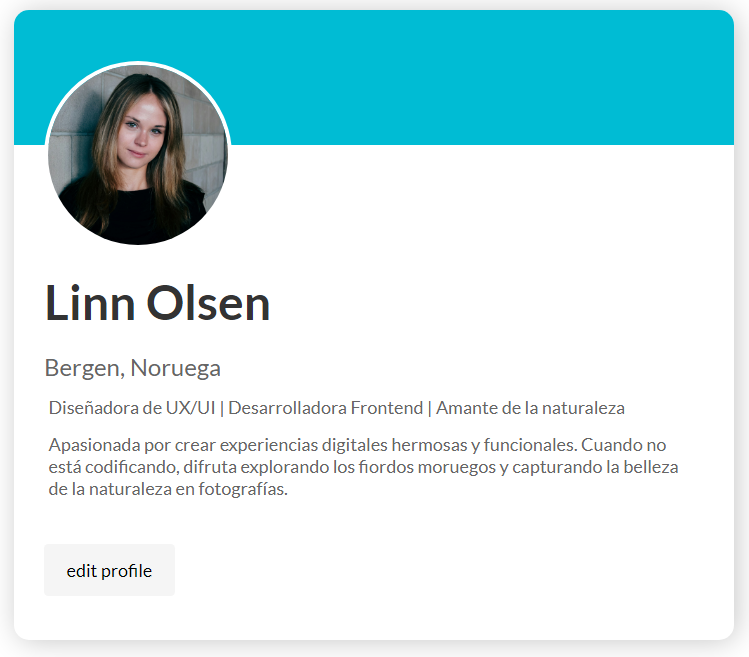

# Tarjeta de Usuario

Esta es una página de tarjeta de usuario diseñada para mostrar la información personal de un usuario. La página está estructurada con HTML y estilizada con CSS.

## Vista del Diseño

Aquí puedes ver la imagen del modelo que se utilizó como referencia:

## Vista Codificada

A continuación, se muestra la imagen del resultado codificado:

## Estructura del Proyecto

El proyecto se compone de las siguientes secciones:

- **Main**: Contiene la tarjeta de usuario.
  - **Tarjeta de Usuario**: Información del usuario, incluyendo foto, nombre, ubicación, profesión, descripción y enlace para editar el perfil.

## Tecnologías Utilizadas
- HTML5: Para la estructura del contenido.
- CSS3: Para el diseño y estilos de la página.

## Autor

Este proyecto fue desarrollado por **Valeria Torrealba**.